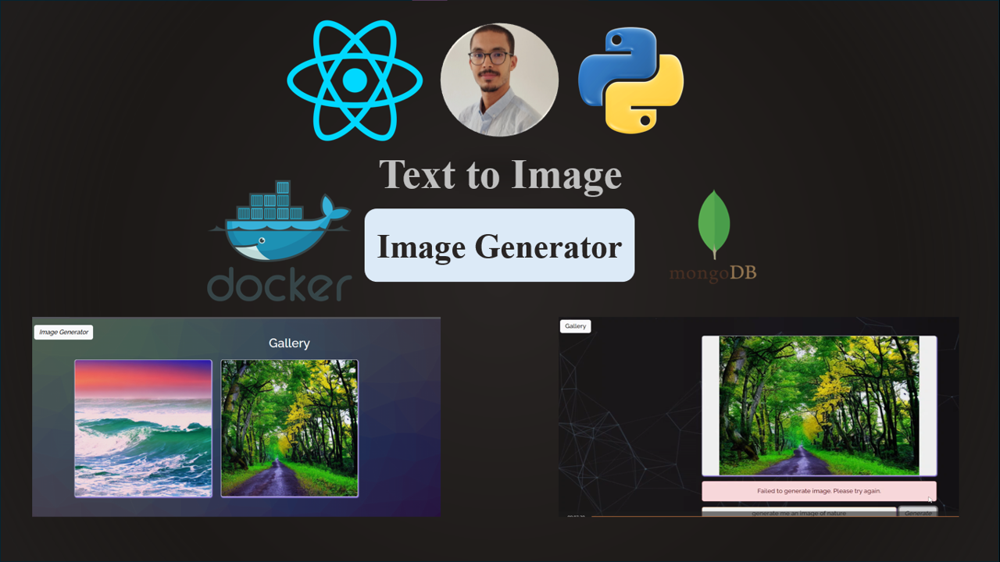

# VisioForge: AI-Powered Image Generation with React & Flask



## Description

VisioForge is a cutting-edge web application that enables users to generate stunning images from text prompts using the power of artificial intelligence. Built with a modern tech stack, VisioForge combines the responsiveness of a React.js frontend with the robustness of a Flask backend, all while leveraging MongoDB for efficient data storage. Whether you're exploring creative ideas or building a gallery of AI-generated art, VisioForge offers a seamless and intuitive platform for bringing your visual concepts to life.
## Features

- **Image Generation:** Users can input a text prompt to generate images using an AI model.
- **Gallery:** A gallery page that displays previously generated images stored in MongoDB.
- **Responsive Design:** The application is designed to be responsive, providing a smooth user experience across different devices.
- **Dockerized MongoDB:** MongoDB runs inside a Docker container for easy setup and management.

## Technologies Used

- **Frontend:**
  - React.js
  - Bootstrap
- **Backend:**
  - Flask
  - Python
  - Diffusers (Hugging Face)
  - Torch
- **Database:**
  - MongoDB
- **Containerization:**
  - Docker

## Setup and Installation

### Prerequisites

- Node.js
- Docker
- Python
### Clone the Repository

```bash
git clone https://github.com/SoufianeElghazi/image-generator-react-diffusers.git
cd mern-stack-image-generation
```
### Lunch your docker compose to start mongodb container :
```bash
docker-compose up -d
docker ps
```
### Connect to your mongodb container using a client cli like mongosh with the string :
```bash
mongodb://localhost:27017/
```
### Then query your data with cli :
```bash
use mydatabase
show dbs
show collections
db.images.find().pretty()
exit
```

### Lunch your backend :

```bash
virtualenv myenv
.\myenv\Scripts\activate
pip install pymongo flask transformers diffusers torch torchvision pillow
python app.py
```

### Lunch your frontend :

```bash
npx create-react-app .
npm start
npm install bootstrap react-bootstrap axios react-router-dom
npm start
```